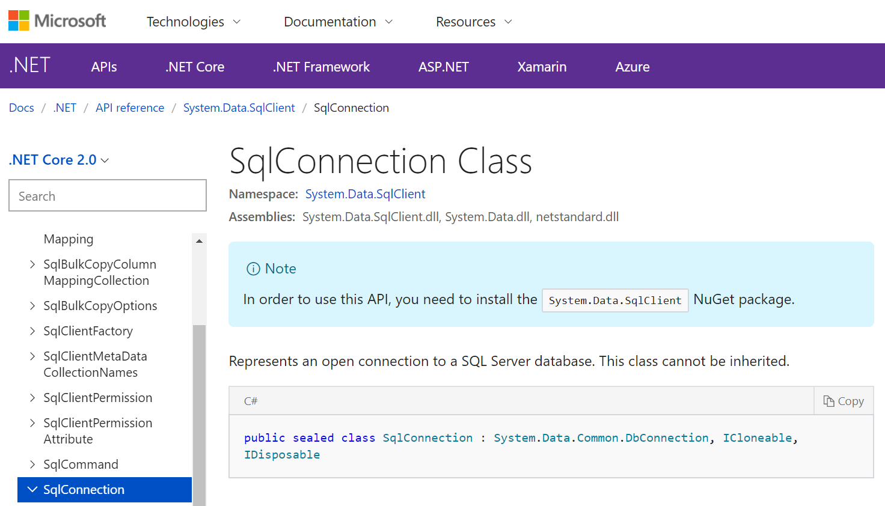
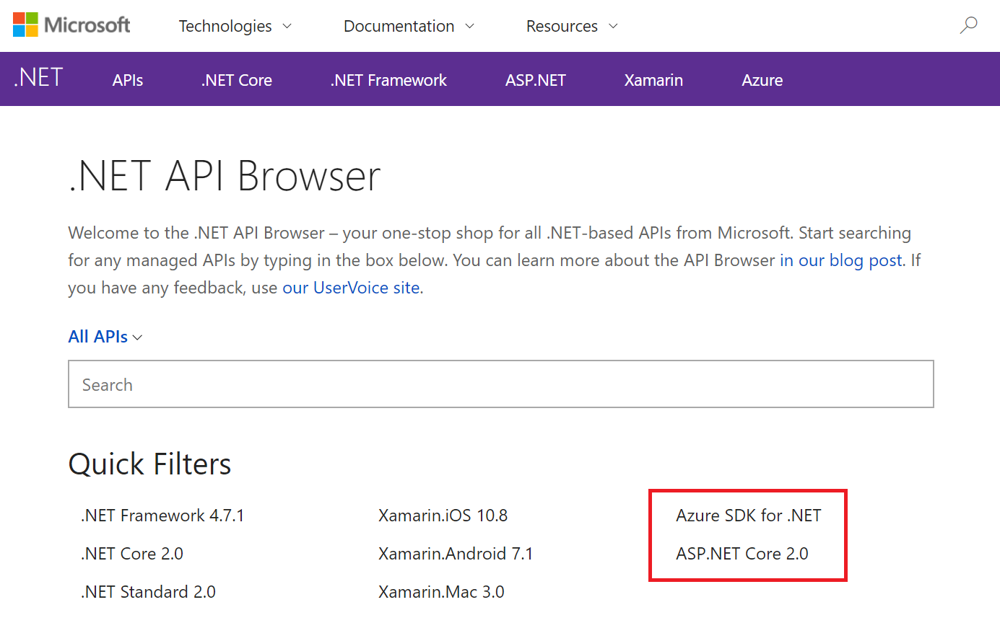

# Package Information in API Reference

**PM** [Immo Landwerth](https://github.com/terrajobst) |
**Dev** [Wes Haggard](https://github.com/weshaggard)

With .NET Core, we've blurred the line between APIs that ship as part of the
framework and APIs that ship as NuGet packages. We need to update the
documentation to indicate whether an API requires installing a NuGet package and
whether the API is currently in preview.

API documentation is key for helping developers browse, discover, and understand
how APIs should be used. The MSDN system was quite dated and we've moved to a
new [API browser] that fully supports an open source model, leveraging GitHub.

The current system works by indexing the output of our product builds. Since
.NET Core 2.0, the output can be roughly classified as *framework component* or
*framework extension*:

* **Framework components** are considered part of the .NET Core framework which
  means the developer doesn't need to do anything in order to use the API;
  conversely, using a later version of the API requires updating the framework
  itself.

* **Framework extensions** are built from from the same source tree but are
  distributed as NuGet packages. Since those aren't included by the framework,
  the developer needs to acquire them manually. Using a later version of the API
  often doesn't require updating the framework but only installing a newer
  version of the package.

Unfortunately, our documentation doesn't distinguish between framework and
framework extension. This causes confusion as the documentation presents APIs as
available without indicating that using it requires installing a NuGet package.
Furthermore, it also renders prerelease functionality the same way as mature
framework components, causing developers to believe that technologies are stable
while they are in fact still in preview. A good example of such an API is
[`Span<T>`][Span].

## Scenarios and User Experience

### Discovering the package

Julie builds a .NET Core application. She'd like to store data in an Azure SQL
database. After copy and pasting some sample code, she notices that the compiler
cannot find the type `SqlConnection`, so she searches the API browser for the
`SqlConnection` class to figure out what she needs to do. Looking at the header,
it's clear to her that she needs to install the `System.Data.SqlClient` NuGet
package:



### Understanding that an API is in preview

Jake has seen some comments on Twitter about the new `Span<T>` type. He decides
to find out more and searches for the API in the docs. He quickly finds the
topic and is informed that while this API is available for .NET Core 2.0, it's
currently in preview. Jake decides to wait a bit longer before he invests
significant time learning an API that is still evolving.


## Requirements

### Goals

* **Origin should be obvious**. Developers need to be able to tell whether a
  given API is part of the framework or whether they have to acquire it
  separately by installing a NuGet package.

* **Quality should be obvious**. Developers need to be able to tell whether a
  given API is considered stable or provided by a prerelease NuGet package. Note
  that this is often different from the framework itself. For instance, they
  might browse the contents of the stable .NET Core 2.0 framework, but they
  might find a new API that is provided as a package and that package might
  still be in beta.

* **Compatibility should be obvious**. Developers should be able to browse the
  documentation without having to understand whether a given API is available
  because it happens to be provided as a .NET Standard-based library or whether
  it's a framework-specific API. A package that provides APIs to multiple
  frameworks should therefore show up for all these frameworks, following NuGet
  compatibility rules.

* **No superfluous installs**. There will be cases where framework-extensions
  eventually become built-in framework components. Due to versioning, the
  framework extension will still be applicable and thus installing the package
  is possible. However, we don't want our docs to point developers to the package
  in these cases as the package will be redundant as the implementation no-ops.

### Non-Goals

* **Fully unifying frameworks with package-based monikers**. Today, the [API
  browser] has separate monikers for frameworks (such as .NET Framework and .NET
  Core) and fully NuGet-based products (such as ASP.NET Core and the Azure SDK).
  We'll only include NuGet packages in the framework monikers that (1) we
  consider framework extensions and (2) that aren't big enough to warrant having
  a moniker on their own.

## Design

We'll provide a drop location for the documentation indexer that will roughly
look like this:

```
├───netcore2.0
│       System.Runtime.dll
│       System.Collections.dll
│       ...
└───extensions
        System.Collections.Immutable_1.2.3.nukpkg
        System.Memory_0.1.2-beta.nukpkg
        ...
```

The intent is as follows:

* **Frameworks** (.NET Framework, .NET Core, .NET Standard) will be provided as
  a set of reference assemblies.

* **Framework extensions** are provided as NuGet packages. Each package will
  have its own version and quality label and the contents of the package will
  indicate which frameworks the APIs are available for.

We expect the documentation system to index the packages to create a data file
that maps APIs to frameworks. Logically, the indexer needs to call into NuGet to
get the list of assemblies for a given framework moniker. If a package doesn't
support a given framework, that list is considered empty.

The indexing algorithm would roughly look as follows:

```
get list of all framework monikers PS supported by the API browser
for each NuGet package N on drop share
    for each P in PS
        get list of all reference assemblies AS for P
        for each A in AS
            get list of all APIs MS in A
            for each M in MS
                mark M as available for P
```

This file should be an input to the process that tags APIs with specific
framework monikers (e.g. that tags `System.String` to be contained in `net45`,
`net461`, `netcoreapp1.0`, `netcoreapp1.1` etc).

Please note that the process as outlined above will ensure that if a package
only provides an API for .NET Standard it will show up on all frameworks that
implement that version of the standard, which is the desired behavior.
Furthermore, if an API is made available for a specific framework, it will also
show up as being available on all later versions of the same framework, which is
also desired behavior.

### Framework vs. Framework-Extensions

There will be cases where a framework extension becomes part of a framework. For
example, `System.Memory` is a framework extension that will target .NET Standard
and thus applies to all .NET implementation. However, moving forward the APIs
will be added directly to the core assembly so that the runtime can be aware of
it and provide a more performant implementation. The behavior we want is that
the header that indicates a NuGet package is needed shouldn't been shown if the
API is built-in. One way to provide the semantics is to introduce a `built-in`
tag that is applied during indexing. If that tag is present, the header
shouldn't be shown.

All APIs provided in the reference assemblies (as opposed to any NuGet packages)
should be considered built-in:

```
get list of all framework monikers PS supported by the API browser
for each P in PS
    get list of all reference assemblies AS for P
    for each A in AS
        get list of all APIs MS in A
        for each M in MS
            mark M as built-in for P
```

## Q & A

### Why are we only indexing framework extensions?

Several Microsoft products are exclusively provided as a set of NuGet packages,
for instance the [Azure SDK] and [ASP.NET Core]:



Based on user studies we've learned that customers prefer products like these to
have their own filter so that they can see which APIs these technologies have to
offer. Conversely, we found that for smaller extensions (such as immutable
collections) customers expect them to find as part of the regular framework API
reference.

While there is no clear-cut definition of what constitutes a framework extension
and what constitutes a separate product, the rule of thumb is: if the API is in
the `System` namespace, it's a framework extension. Some APIs that are in the
`Microsoft` namespace are also considered framework extensions, such as compiler
specific APIs and wrappers around Win32 technologies.

[API browser]: https://docs.microsoft.com/en-us/dotnet/api/
[ASP.NET Core]: https://docs.microsoft.com/en-us/dotnet/api/?view=aspnetcore-2.0
[Azure SDK]: https://docs.microsoft.com/en-us/dotnet/api/?view=azure-dotnet
[Span]: https://docs.microsoft.com/en-us/dotnet/api/system.span-1?view=netcore-2.0
